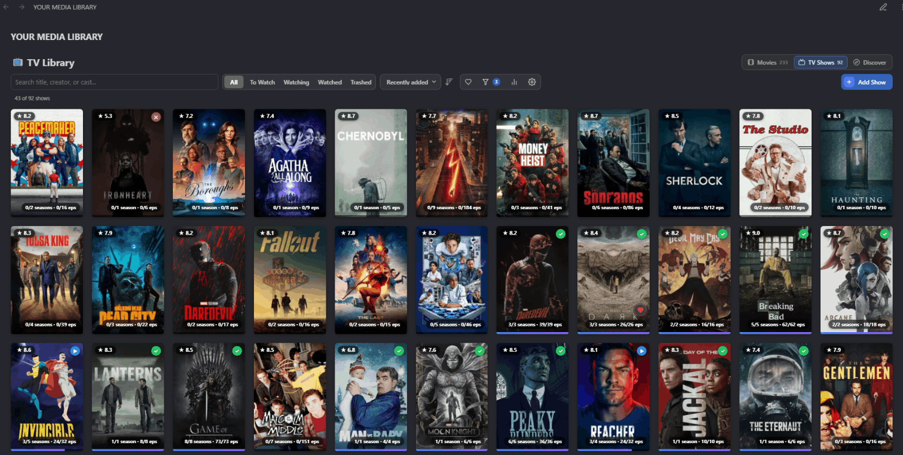

# TerroTrack

An [Obsidian](https://obsidian.md) plugin for tracking **Movies & TV Shows**. Discover trending titles and add them to your collection directly from the plugin. Your data is stored as plain JSON and can be exported as CSV.


## ✨ Features

**Libraries**
- 🎬 Movie & 📺 TV show libraries, each with its own card fields, filters, and stats
- 🖼️ Poster-based gallery with adjustable card size and column count
- 🎛️ Four-way status: **To Watch · Watching · Watched · Trashed**
- ❤️ Favourites — one-tap heart on posters, plus a favourites-only toolbar filter
- ⭐ Personal star ratings, 5 stars at half-star precision
- 📝 Personal notes with a preview card and a full reading/editing layer
- 📺 TV progress tracks seasons and episodes together, with a per-day logging date

**Discover** *(requires a TMDB API key)*
- ✨ Picked for you — recommendations built from your own ratings, genres, and watch history
- 🔥 Trending this week
- 🆕 In theaters now / On the air
- 📅 Coming soon — upcoming releases and new series

**Search, filter, sort**
- 🔍 Search by title, director/creator, and cast
- 🏷️ Filter by genre, year, language, TMDB rating, and your own rating (+ series status on TV)
- 📆 Dual-handle year picker with Range and Individual modes
- ↕️ Sort by Recently added, Title, Year, Rating, or Runtime, ascending or descending

**Stats**
- ⏱️ Total watch time with a playful tier badge
- 🍩 Watched / Watching / To Watch / Trashed breakdown as a donut
- 🥧 Genre distribution as a labelled pie
- 🎯 Viewing habits — favourite year, top director/creator, most-seen actor — click to jump to those titles
- 🗓️ GitHub-style activity heatmap with Week / Month / Year / All-time views, a Movies/TV/All filter, and current/longest streak tiles

**Data**
- 📄 Plain JSON storage — inspect, edit, or move it outside Obsidian
- 💾 CSV backups (full round-trip) and TXT exports
- 📥 Import from TerroTrack backups, IMDb, and Letterboxd (movies only)
- 🔄 Update database — re-fetch TMDB metadata while keeping your status, notes, ratings, and progress

---

## 📖 Usage



**Add a title → Rate it → Track seasons & episodes → Add personal notes → Edit details → Update information → Watch trailer**

---

## 📦 Installation

### Manual Installation

> Make sure to turn off restricted mode.
#### 1. Download
- Download **TerroTrack** from the [latest release](https://github.com/cyber-joy/TerroTrack/releases).
- Extract the ZIP file.
#### 2. location
- Open your Obsidian vault's plugin folder.
- Copy the entire plugin folder into it.
      
```
YourVault/
└── .obsidian/
    └── plugins/
```

#### 3. Enable the Plugin
- Open Obsidian **Settings** → **Community plugins**
- Find **TerroTrack** in the installed plugins list.
- Enable it.

<p>
    
</p>

---

## Quick start

### 1. Add your TMDB API key

- Go to **Settings → TerroTrack → TMDB API key**.
- Paste your key.

If you don't have one, see [How to get your free TMDB API key](#How-to-get-your-free-TMDB-API-key) below.

### 2. View your Library

In any note, add one of these code blocks:

````
```terro-movie
```
````
or
````
```terro-tv
```
````
Both render the same interface — a **Movies / TV Shows** tab bar. The only difference is which tab opens first.

### 3. Add your first title.
Click:

* **+ Add Movie**
* **+ Add Show**

You can search TMDB and select a result, or skip the search and use the **OR ENTER MANUALLY** form for titles that aren't available on TMDB.

---

# 💾 Data Storage

TerroTrack stores your library as plain JSON files.

By default:

```text
movies.json
tvshows.json
```

Both filenames can be changed in the plugin settings.

The data is stored as regular text, making it easy to inspect, edit, back up, or move outside Obsidian.

---

## 🎬 Movie Data

Example:

```json
{
  "id": 438631,
  "title": "Dune",
  "year": "2021",
  "poster_path": "/d5NXSklXo0qyIYkgV94XAgMIckC.jpg",
  "rating": "8.2",
  "myRating": "9",
  "watched": true,
  "release_date": "2021-10-22",
  "runtime": 155,
  "original_language": "en",
  "budget": 165000000,
  "genres": "Science Fiction, Adventure",
  "director": "Denis Villeneuve",
  "cast": "Timothée Chalamet, Rebecca Ferguson, ...",
  "overview": "...",
  "notes": "",
  "trailer_key": "8g18jFHCLXk"
}
```

---

## 📺 TV Show Data

Example:

```json
{
  "id": 1396,
  "name": "Breaking Bad",
  "year": "2008",
  "poster_path": "/ggFHVNu6YYI5L9pCfOacjizRGt.jpg",
  "rating": "8.9",
  "myRating": "10",
  "watched": true,
  "first_air_date": "2008-01-20",
  "episode_runtime": 47,
  "original_language": "en",
  "genres": "Drama, Crime",
  "creators": "Vince Gilligan",
  "cast": "Bryan Cranston, Aaron Paul, ...",
  "overview": "...",
  "notes": "",
  "trailer_key": "",
  "number_of_seasons": 5,
  "number_of_episodes": 62,
  "show_status": "Ended"
}
```

Because the files are plain JSON, you can manually edit them whenever necessary or process them using external tools.

---

## How to get your free TMDB API key
1. Create a free account at [themoviedb.org](https://www.themoviedb.org).
2. Go to **Settings → [API](https://www.themoviedb.org/settings/api)**.
3. Request an API key and choose the **Developer** option.
4. Copy the **API Key (v3 auth)** — a 32-character hex string.
5. Paste it into **Settings → TerroTrack → TMDB API key**.

The key is stored in the plugin's `data.json` and stays on your machine.

Without it, the plugin still works — manual entry, gallery, filters, sorting, notes, ratings, backups, and native-backup imports all function. You lose TMDB search, Discover, metadata updates, and IMDb/Letterboxd enrichment.

---

## 📱 Compatibility

TerroTrack is designed to work on:

* Windows
* macOS
* Linux
* Android
* iOS

through Obsidian's desktop and mobile applications.

---

## 📄 License

MIT — see [LICENSE](LICENSE).
